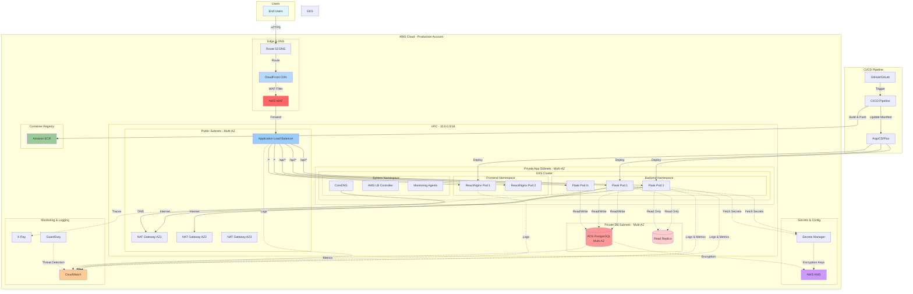

# Cloud Architecture Design for Innovate Inc.

## Executive Summary

This document outlines a comprehensive cloud architecture for Innovate Inc.'s web application on AWS. The design emphasizes security, scalability, cost-effectiveness, and operational excellence while accommodating growth from hundreds to millions of users.

## Technology Stack Overview

- **Backend**: Python/Flask (REST API)
- **Frontend**: React (SPA)
- **Database**: PostgreSQL
- **Cloud Provider**: AWS
- **Container Orchestration**: Amazon EKS (Elastic Kubernetes Service)

---

## 1. Cloud Environment Structure

### Recommended AWS Account Strategy

**Recommendation**: Multi-Account Architecture with 5 accounts

#### Account Structure:

1. **Management/Root Account**
   - Purpose: Centralized billing, AWS Organizations management
   - No workloads deployed here
   - Consolidated billing for all accounts

2. **Logging/Security Account**
   - Purpose: Centralized logging and security monitoring
   - Aggregates CloudTrail logs from all accounts
   - Hosts security tools (GuardDuty, Security Hub, AWS Config)
   - Long-term log retention and compliance archives
   - Isolated access - security team only

3. **Development Account**
   - Purpose: Development and testing environment
   - Lower-cost resources, relaxed security for developer productivity
   - Isolated from production data

4. **Staging Account**
   - Purpose: Pre-production testing and QA
   - Mirror of production architecture (smaller scale)
   - Integration testing and performance validation

5. **Production Account**
   - Purpose: Live customer-facing application
   - Highest security standards and compliance controls
   - Production data and workloads only

#### Justification:

- **Isolation**: Prevents development activities from impacting production
- **Security**: Blast radius containment - compromise of one account doesn't affect others
- **Centralized Logging**: Dedicated logging account prevents log tampering and ensures compliance
- **Security Monitoring**: Isolated security tooling with restricted access
- **Cost Management**: Clear cost attribution per environment
- **Compliance**: Easier to apply different compliance requirements per environment
- **Access Control**: Environment-specific IAM policies and permissions
- **Audit Trail**: Immutable log storage for forensics and compliance audits
- **Flexibility**: Can add new accounts (e.g., Shared Services, DR) as needed

#### Implementation Details:

- Use **AWS Organizations** for centralized management
- Implement **Service Control Policies (SCPs)** for guardrails
- Enable **AWS CloudTrail** across all accounts with logs sent to Logging/Security Account
- Use **AWS Control Tower** for automated account provisioning and governance
- Configure **CloudWatch Logs** cross-account streaming to Logging Account
- Enable **AWS Config** for compliance tracking across all accounts
- Set up **S3 bucket** in Logging Account with lifecycle policies for long-term retention (7-10 years)

---

## 2. Network Design

### VPC Architecture

#### Design: Multi-AZ, Three-Tier Architecture

Each environment (Dev, Staging, Prod) will have its own VPC with the following structure:

**Production VPC Specifications:**
- **CIDR Block**: 10.0.0.0/16 (65,536 IPs)
- **Availability Zones**: 3 AZs for high availability
- **Subnet Strategy**: Public, Private Application, and Private Database subnets

#### Subnet Layout (per AZ):

1. **Public Subnets** (DMZ)
   - 10.0.1.0/24, 10.0.2.0/24, 10.0.3.0/24 (256 IPs each)
   - Hosts: ALB (Application Load Balancer), NAT Gateways, Bastion hosts
   - Internet Gateway attached

2. **Private Application Subnets** (Large)
   - 10.0.16.0/20, 10.0.32.0/20, 10.0.48.0/20 (4,096 IPs each)
   - Total: 12,288 IPs for application workloads
   - Hosts: EKS worker nodes, application containers
   - Outbound internet via NAT Gateways
   - Sufficient IP space for large-scale pod deployments

3. **Private Database Subnets** (Medium-Large)
   - 10.0.64.0/21, 10.0.72.0/21, 10.0.80.0/21 (2,048 IPs each)
   - Total: 6,144 IPs for database resources
   - Hosts: RDS PostgreSQL instances, ElastiCache clusters
   - No internet access (inbound or outbound)
   - Allows for multiple database instances and read replicas

#### Network Security

**1. Security Groups (Stateful Firewall)**

- **ALB Security Group**
  - Inbound: 443 (HTTPS) from 0.0.0.0/0, 80 (HTTP) redirect to HTTPS
  - Outbound: Ephemeral ports to Application SG

- **EKS Node Security Group**
  - Inbound:
    - From ALB SG on application ports (8080)
    - From EKS Control Plane for management
    - Inter-node communication
  - Outbound: 443 to internet (via NAT), database ports to RDS SG

- **RDS Security Group**
  - Inbound: PostgreSQL (5432) from EKS Node SG only
  - Outbound: None required

**2. Network ACLs (Stateless Firewall)**

Network ACLs provide an additional layer of defense at the subnet level. Rules are evaluated in order by rule number.

**Public Subnet NACL Rules:**

*Inbound Rules:*
- Rule 100: Allow HTTP (80) from 0.0.0.0/0
- Rule 110: Allow HTTPS (443) from 0.0.0.0/0
- Rule 120: Allow Ephemeral ports (1024-65535) from 0.0.0.0/0 (for return traffic)
- Rule 130: Allow SSH (22) from Corporate IP ranges (for Bastion access)
- Rule 140: Allow all traffic from VPC CIDR (10.0.0.0/16)
- Rule 32767: Deny all (default)

*Outbound Rules:*
- Rule 100: Allow HTTP (80) to 0.0.0.0/0
- Rule 110: Allow HTTPS (443) to 0.0.0.0/0
- Rule 120: Allow Ephemeral ports (1024-65535) to 0.0.0.0/0
- Rule 130: Allow all traffic to VPC CIDR (10.0.0.0/16)
- Rule 32767: Deny all (default)

**Private Application Subnet NACL Rules:**

*Inbound Rules:*
- Rule 100: Allow all traffic from VPC CIDR (10.0.0.0/16)
- Rule 110: Allow Ephemeral ports (1024-65535) from 0.0.0.0/0 (for return traffic from internet via NAT)
- Rule 32767: Deny all (default)

*Outbound Rules:*
- Rule 100: Allow all traffic to VPC CIDR (10.0.0.0/16)
- Rule 110: Allow HTTP (80) to 0.0.0.0/0 (for package downloads)
- Rule 120: Allow HTTPS (443) to 0.0.0.0/0 (for API calls, updates)
- Rule 130: Allow Ephemeral ports (1024-65535) to 0.0.0.0/0
- Rule 32767: Deny all (default)

**Private Database Subnet NACL Rules:**

*Inbound Rules:*
- Rule 100: Allow PostgreSQL (5432) from Private Application Subnets (10.0.16.0/20, 10.0.32.0/20, 10.0.48.0/20)
- Rule 120: Allow Ephemeral ports (1024-65535) from VPC CIDR (10.0.0.0/16)
- Rule 32767: Deny all (default)

*Outbound Rules:*
- Rule 100: Allow all traffic to VPC CIDR (10.0.0.0/16)
- Rule 110: Allow Ephemeral ports (1024-65535) to Private Application Subnets
- Rule 32767: Deny all (default)

**Key Principles:**
- Deny all by default, allow only necessary traffic
- Public subnets: Only HTTP/HTTPS from internet
- Private subnets: Only traffic from within VPC
- Database subnets: Only database ports from application subnets
- Stateless rules require both inbound and outbound rules for bidirectional traffic

**3. VPC Flow Logs**

- Enable for all VPCs
- Send to CloudWatch Logs or S3 for analysis
- Monitor suspicious traffic patterns

**4. AWS PrivateLink**

- Use VPC Endpoints for AWS services (S3, ECR, CloudWatch)
- Keeps traffic within AWS network
- Reduces NAT Gateway costs and improves security

**5. Network Segmentation**

- No direct routing between environments (Dev/Staging/Prod)
- VPC Peering only if absolutely necessary (e.g., Shared Services)
- Transit Gateway for future multi-region expansion

---

## 3. Compute Platform - Amazon EKS

### EKS Cluster Design

**Cluster Configuration:**

- **Control Plane**: Fully managed by AWS, multi-AZ by default
- **Kubernetes Version**: Latest stable version (e.g., 1.28+)
- **Authentication**: IAM-based authentication using AWS IAM Authenticator
- **Cluster Endpoint**: Private endpoint access for security, public for CI/CD

### Node Groups Strategy

**1. System Node Group (Managed)**

For critical system components, use AWS Managed Node Groups:

- **System Node Group** (Always-on)
  - Purpose: Critical system pods (CoreDNS, kube-proxy, AWS Load Balancer Controller, Karpenter controller)
  - Instance Type: t3.medium (2 vCPU, 4GB RAM)
  - Scaling: 2-3 nodes (for HA)
  - Labels: `workload-type=system`
  - Taints: `node-role.kubernetes.io/system:NoSchedule`
  - On-Demand instances (high availability required)

**2. Application Workloads with Karpenter**

Use Karpenter for all application workloads to provide intelligent, cost-optimized auto-scaling:

**Karpenter Benefits:**
- **Dynamic Provisioning**: Automatically provisions nodes based on actual pod requirements
- **Cost Optimization**: Intelligently selects cheapest instance types that meet workload needs
- **Spot Instance Support**: Uses Spot instances where appropriate (non-critical workloads) with automatic fallback to On-Demand
- **Fast Scaling**: Sub-minute node provisioning vs. 5-10 minutes with Cluster Autoscaler
- **Bin Packing**: Efficiently consolidates pods to minimize node count and cost
- **Automatic Deprovisioning**: Removes underutilized nodes automatically

**Karpenter Scaling Behavior:**

- **Scale-Up**: When pods are pending, Karpenter provisions new nodes in 30-60 seconds
- **Scale-Down**: Automatically removes nodes when underutilized (< 50% capacity for 30 seconds)
- **Node Consolidation**: Continuously evaluates if pods can be packed onto fewer nodes
- **Instance Type Selection**: Chooses the most cost-effective instance type that meets resource requirements
- **Spot Instance Handling**: Automatically moves pods when Spot interruption notice received (2-minute warning)

### Resource Allocation

**Namespace Strategy:**

- `kube-system`: System components
- `ingress`: Ingress controllers and load balancers
- `backend`: Flask API pods
- `frontend`: React SPA pods (served via Nginx)
- `monitoring`: Prometheus, Grafana
- `logging`: Fluent Bit, CloudWatch integration

**Resource Requests and Limits:**

```yaml
# Backend Pod Example
resources:
  requests:
    cpu: 250m
    memory: 512Mi
  limits:
    cpu: 1000m
    memory: 1Gi
```

**Horizontal Pod Autoscaler (HPA):**

- Target CPU Utilization: 70%
- Min Replicas: 2 (HA)
- Max Replicas: 50 (adjust based on load testing)

**Karpenter Node Autoscaling:**

- Automatically provisions and deprovisions nodes based on pod scheduling needs
- Works in conjunction with HPA for complete autoscaling (HPA scales pods, Karpenter scales nodes)
- Faster and more cost-efficient than traditional Cluster Autoscaler

### Containerization Strategy

**1. Image Building**

- **CI/CD Pipeline**: GitHub Actions / GitLab CI / AWS CodePipeline
- **Build Process**:
  - Multi-stage Docker builds for smaller images
  - Separate builds for backend and frontend
  - Image scanning with Trivy or AWS ECR Image Scanning

**Example Backend Dockerfile:**

```dockerfile
# Build stage
FROM python:3.11-slim AS builder
WORKDIR /app
COPY requirements.txt .
RUN pip install --user --no-cache-dir -r requirements.txt

# Runtime stage
FROM python:3.11-slim
WORKDIR /app
COPY --from=builder /root/.local /root/.local
COPY . .
ENV PATH=/root/.local/bin:$PATH
EXPOSE 8080
CMD ["gunicorn", "-b", "0.0.0.0:8080", "-w", "4", "app:app"]
```

**2. Container Registry**

- **AWS ECR (Elastic Container Registry)**
- Private repositories per service
- Image lifecycle policies (retain last 10 tags, delete untagged)
- Image scanning on push for vulnerabilities
- Cross-region replication for disaster recovery

**3. Deployment Process**

- **GitOps with ArgoCD or Flux**:
  - Declarative Kubernetes manifests in Git
  - Automated sync from Git to cluster
  - Rollback capabilities
  - Multi-environment promotion (Dev → Staging → Prod)

- **Deployment Strategy**:
  - Rolling updates (default)
  - Blue-Green deployments for zero-downtime releases
  - Canary deployments for gradual rollout (10% → 50% → 100%)

**Helm Charts for Application Packaging:**

```
innovate-app/
├── Chart.yaml
├── values.yaml
├── values-dev.yaml
├── values-staging.yaml
├── values-prod.yaml
└── templates/
    ├── backend-deployment.yaml
    ├── backend-service.yaml
    ├── frontend-deployment.yaml
    ├── frontend-service.yaml
    └── ingress.yaml
```

---

## 4. Database - Amazon RDS PostgreSQL

### Service Recommendation

**Amazon RDS for PostgreSQL**

#### Justification:

- **Fully Managed**: AWS handles patching, backups, and maintenance
- **High Availability**: Multi-AZ deployment with automatic failover
- **Scalability**: Vertical scaling (instance size) and read replicas
- **Security**: Encryption at rest and in transit, IAM database authentication
- **Cost-Effective**: No need to manage database infrastructure
- **PostgreSQL Compatibility**: Full PostgreSQL feature set

### Database Configuration

**Production Instance Specifications:**

- **Instance Class**:
  - Initial: db.t4g.large (2 vCPU, 8GB RAM)
  - Growth: Scale to db.r6g.xlarge or larger (memory-optimized)
- **Storage**:
  - Type: gp3 SSD (better performance than gp2)
  - Initial Size: 100GB
  - Auto-scaling enabled (up to 1TB)
- **PostgreSQL Version**: Latest stable (e.g., PostgreSQL 15+)
- **Multi-AZ**: Enabled (synchronous replication to standby)
- **Encryption**:
  - At rest: AWS KMS encryption
  - In transit: SSL/TLS enforced

### High Availability Strategy

**1. Multi-AZ Deployment**

- **Primary Instance**: Active database in AZ-1
- **Standby Instance**: Synchronous replica in AZ-2
- **Automatic Failover**:
  - RDS automatically fails over to standby in case of:
    - Primary AZ failure
    - Primary instance failure
    - Storage or network issues
  - Failover time: Typically 60-120 seconds
  - DNS endpoint remains the same (application connection string unchanged)

**2. Read Replicas**

- Deploy 1-3 read replicas for:
  - Read-heavy workloads (reporting, analytics)
  - Geographic distribution (future multi-region)
  - Disaster recovery (can be promoted to master)
- **Asynchronous replication** from primary
- Can be in different AZs or regions

### Backup Strategy

**1. Automated Backups**

- **Retention Period**: 30 days (maximum for RDS)
- **Backup Window**: During low-traffic hours (e.g., 2:00-3:00 AM UTC)
- **Continuous Backup**:
  - Transaction logs backed up every 5 minutes
  - Point-in-time recovery to any second within retention period

**2. Manual Snapshots**

- **Pre-deployment snapshots**: Before major releases
- **Compliance snapshots**: Monthly retention for 1 year
- **Cross-region snapshots**: Copy to secondary region for DR

**3. Backup Testing**

- Quarterly restore drills to staging environment
- Validate recovery procedures and RTO/RPO

### Disaster Recovery Plan

**Recovery Objectives:**

- **RTO (Recovery Time Objective)**: 1 hour
- **RPO (Recovery Point Objective)**: 5 minutes

**DR Scenarios:**

1. **Single AZ Failure**
   - Solution: Multi-AZ automatic failover
   - RTO: 2 minutes, RPO: 0 (synchronous replication)

2. **Regional Disaster**
   - Solution: Cross-region read replica
   - Process:
     1. Promote read replica in secondary region to master
     2. Update application DNS/endpoint
     3. Redirect traffic to secondary region
   - RTO: 30 minutes, RPO: ~1 minute (replication lag)

3. **Data Corruption/Accidental Deletion**
   - Solution: Point-in-time recovery from automated backups
   - RTO: 30-60 minutes, RPO: Up to 5 minutes

**DR Testing:**

- Annual full DR failover test
- Document and improve procedures based on test results

### Database Security

- **Network Isolation**: Database subnet group with no internet access
- **IAM Database Authentication**: For application access (no hardcoded passwords)
- **Secrets Manager**: Store database credentials with automatic rotation
- **Parameter Groups**: Disable unnecessary extensions, enforce SSL
- **Enhanced Monitoring**: Track database performance and anomalies
- **Database Activity Streams**: Audit all database activity for compliance

---

## 5. Additional Architecture Components

### Load Balancing

**AWS Application Load Balancer (ALB)**

- Layer 7 load balancing with path-based routing
- SSL/TLS termination with AWS Certificate Manager (ACM)
- WAF (Web Application Firewall) integration
- Path routing:
  - `/api/*` → Backend service
  - `/*` → Frontend service

### Content Delivery

**Amazon CloudFront (CDN)**

- Global content distribution for React SPA
- Edge locations for low latency
- HTTPS enforcement
- S3 bucket for static assets
- Reduces load on ALB/EKS for static content

### Security

**1. AWS WAF (Web Application Firewall)**

- Protect against OWASP Top 10 vulnerabilities
- Rate limiting to prevent DDoS
- Geo-blocking if needed
- Custom rules for application-specific threats

**2. AWS Secrets Manager**

- Store database credentials, API keys
- Automatic rotation of secrets
- Integration with EKS pods via CSI driver

**3. AWS KMS (Key Management Service)**

- Encryption key management
- Separate keys per environment
- Automatic key rotation

**4. AWS GuardDuty**

- Threat detection for AWS accounts
- Monitor for malicious activity
- Alert on suspicious behavior

**5. Security Groups & IAM**

- Principle of least privilege
- Service accounts with minimal permissions
- Regular IAM access reviews

### Monitoring and Logging

**1. Amazon CloudWatch**

- Centralized logging for all services
- Custom metrics from application
- Alarms for critical issues (CPU, memory, error rates)
- Dashboards for real-time monitoring

**2. Container Insights**

- EKS cluster and pod-level metrics
- Performance monitoring
- Cost allocation by namespace/workload

**3. Application Performance Monitoring (APM)**

- AWS X-Ray for distributed tracing
- Request flow visualization
- Performance bottleneck identification

**4. Log Aggregation**

- Fluent Bit DaemonSet on EKS nodes
- Stream logs to CloudWatch Logs
- Long-term archival to S3 with lifecycle policies

### CI/CD Pipeline

**Pipeline Flow:**

1. **Code Commit** → GitHub/GitLab
2. **Build Trigger** → CI system (GitHub Actions, GitLab CI, AWS CodePipeline)
3. **Build & Test**:
   - Run unit tests
   - Build Docker images
   - Security scanning (SAST, dependency checks)
4. **Push to ECR** → Tag with commit SHA and semantic version
5. **Deploy to Dev** → Automatic via ArgoCD/Flux
6. **Integration Tests** → Automated test suite in Dev
7. **Deploy to Staging** → Manual approval or automatic
8. **QA Testing** → Manual validation in Staging
9. **Deploy to Production** → Manual approval + blue-green/canary deployment
10. **Monitor** → CloudWatch alarms and rollback if needed

### Cost Optimization

**Initial Phase (100-1000 users):**

- Use Savings Plans or Reserved Instances for baseline compute
- t3 instances for cost efficiency
- Leverage AWS Free Tier where applicable
- Single NAT Gateway (dev/staging), multi-NAT for prod HA

**Growth Phase (1000-10000 users):**

- Karpenter automatically scales nodes (already implemented from day one)
- Leverage Spot Instances for non-critical workloads (configured in Karpenter)
- CloudFront caching to reduce origin load
- RDS read replicas to offload read traffic
- Increase Karpenter CPU/memory limits as needed

**Scale Phase (10000+ users):**

- Karpenter handles intelligent node provisioning and cost optimization
- Expand instance type options in Karpenter provisioner for better selection
- Database sharding if needed (future)
- Consider Aurora PostgreSQL for better scalability and global reach

**Continuous Optimization:**

- AWS Cost Explorer and Budgets
- Rightsize instances based on actual usage
- Delete unused resources (old snapshots, ECR images)
- Tag all resources for cost allocation

---

## 6. High-Level Architecture Diagram



---

## 7. Security Best Practices Summary

1. **Network Security**
   - Multi-layer security (WAF, Security Groups, NACLs)
   - Private subnets for applications and databases
   - No direct internet access for compute/database

2. **Data Protection**
   - Encryption at rest (RDS, EBS, S3)
   - Encryption in transit (TLS/SSL everywhere)
   - KMS key management with rotation

3. **Identity & Access**
   - IAM roles for service-to-service communication
   - No long-lived credentials in containers
   - Secrets Manager for sensitive data

4. **Monitoring & Incident Response**
   - CloudTrail for audit logging
   - GuardDuty for threat detection
   - Automated alerts for security events

5. **Compliance**
   - Regular security assessments
   - Vulnerability scanning of container images
   - Patch management for EKS nodes and RDS

---
